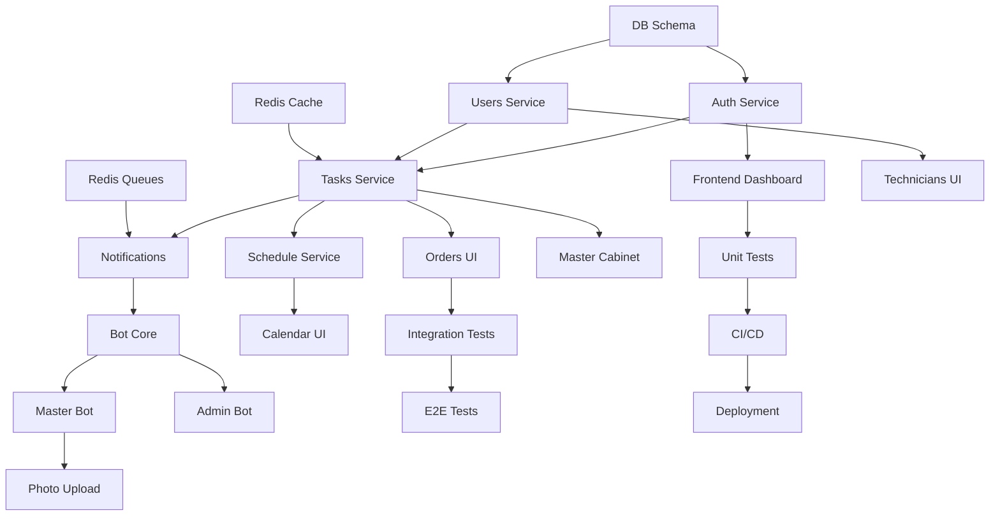

# 🤖 Agent Orchestration Plan

## Обзор

Этот документ описывает план развертывания worker-агентов для параллельной разработки проекта workflow.

## 📋 Список Issues (24 задачи)

### 🔧 Backend Services (Priority: High) - 6 issues

1. **[AUTH-001]** 🔐 Implement JWT authentication & authorization system (3-4 days)
2. **[USERS-001]** 👥 Complete users CRUD & technician management (3-4 days)
3. **[TASKS-001]** 📋 Implement orders & tasks management system (4-5 days)
4. **[SCHEDULE-001]** 📅 Build scheduling & calendar functionality (3-4 days)
5. **[NOTIFY-001]** 🔔 Create notification service (Email/Push/Telegram) (4-5 days)
6. **[REPORTS-001]** 📊 Develop analytics & reporting engine (3-4 days)

### 🤖 Telegram Bot Integration (Priority: High) - 4 issues

7. **[BOT-001]** 🤖 Create Telegram bot core architecture (2-3 days)
8. **[BOT-002]** 👨‍🔧 Implement master commands & workflows (3-4 days)
9. **[BOT-003]** 👨‍💼 Implement admin commands & notifications (2-3 days)
10. **[BOT-004]** 📸 Photo upload & report submission (2-3 days)

### 🎨 Frontend (Priority: Medium) - 5 issues

11. **[FE-001]** 📊 Admin dashboard & analytics (3-4 days)
12. **[FE-002]** 📋 Orders management interface (4-5 days)
13. **[FE-003]** 👥 Technician management interface (3-4 days)
14. **[FE-004]** 📅 Schedule & calendar views (3-4 days)
15. **[FE-005]** 🔧 Master personal cabinet (3-4 days)

### 🗄️ Database & Infrastructure (Priority: High) - 4 issues

16. **[DB-001]** 🗄️ Complete database schema & migrations (2-3 days)
17. **[DB-002]** 🌱 Seed data & test fixtures (1-2 days)
18. **[REDIS-001]** ⚡ Implement caching strategy (2-3 days)
19. **[REDIS-002]** 📬 Set up job queues (2-3 days)

### 🧪 Testing & QA (Priority: Medium) - 3 issues

20. **[TEST-001]** 🧪 Backend unit tests (4-5 days)
21. **[TEST-002]** 🔗 Integration tests (3-4 days)
22. **[TEST-003]** 🎭 E2E tests (3-4 days)

### 🚀 CI/CD & Deployment (Priority: Low) - 2 issues

23. **[CI-001]** ⚙️ GitHub Actions workflows (2-3 days)
24. **[DEPLOY-001]** 🚀 Production deployment setup (5-7 days)

---

## 🚀 Быстрый старт

### Шаг 1: Авторизация в GitHub

```bash
gh auth login
```

Следуйте инструкциям для авторизации через браузер или токен.

### Шаг 2: Создание всех Issues

```bash
./.github/create-all-issues.sh
```

Этот скрипт создаст все 24 issue в репозитории `endurohard/workflow`.

### Шаг 3: Проверка созданных Issues

```bash
gh issue list --repo endurohard/workflow
```

---

## 🤖 Запуск Agent Orchestrator

### Проверка статуса AO

```bash
ao status
```

### Запуск Dashboard

```bash
PORT=3001 ao start
```

Откройте http://localhost:3001 в браузере.

### Spawning агентов по приоритетам

#### Phase 1: Critical Infrastructure (параллельно)

```bash
# Database и Core Services
ao batch-spawn workflow AUTH-001 USERS-001 DB-001 REDIS-001 REDIS-002
```

#### Phase 2: Core Business Logic (после Phase 1)

```bash
# Tasks и Scheduling
ao batch-spawn workflow TASKS-001 SCHEDULE-001 NOTIFY-001
```

#### Phase 3: Telegram Bot (после Phase 2)

```bash
# Bot Integration
ao batch-spawn workflow BOT-001 BOT-002 BOT-003 BOT-004
```

#### Phase 4: Frontend (параллельно с Phase 3)

```bash
# Frontend Components
ao batch-spawn workflow FE-001 FE-002 FE-003 FE-004 FE-005
```

#### Phase 5: Testing & Analytics (после Phase 4)

```bash
# Reports and Tests
ao batch-spawn workflow REPORTS-001 TEST-001 TEST-002 DB-002
```

#### Phase 6: CI/CD & Deployment (финальная фаза)

```bash
# DevOps
ao batch-spawn workflow CI-001 TEST-003 DEPLOY-001
```

---

## 📊 Мониторинг прогресса

### Просмотр всех сессий

```bash
ao session ls -p workflow
```

### Просмотр статуса

```bash
ao status
```

### Подключение к сессии агента

```bash
ao session attach wor-1
```

### Отправка сообщения агенту

```bash
ao send wor-1 "Пожалуйста, добавь тесты для функции login"
```

### Просмотр логов сессии

```bash
ao logs wor-1
```

---

## 🔄 Управление сессиями

### Убийство сессии

```bash
ao session kill wor-1
```

### Очистка завершенных сессий

```bash
ao session cleanup -p workflow
```

### Открытие всех сессий в терминале

```bash
ao open workflow
```

---

## 📈 Стратегия развертывания

### Подход "Волнами"

1. **Волна 1** (День 1-3): Infrastructure + Auth + Users + DB
   - Базовая инфраструктура
   - Аутентификация
   - Управление пользователями
   - База данных

2. **Волна 2** (День 4-7): Core Business Logic
   - Tasks management
   - Scheduling
   - Notifications
   - Redis queues

3. **Волна 3** (День 8-11): Telegram Bot
   - Bot architecture
   - Master commands
   - Admin commands
   - Photo upload

4. **Волна 4** (День 12-16): Frontend
   - Admin dashboard
   - Orders interface
   - Technician management
   - Calendar views
   - Master cabinet

5. **Волна 5** (День 17-20): Testing & Analytics
   - Reports
   - Unit tests
   - Integration tests
   - Seed data

6. **Волна 6** (День 21-23): DevOps
   - CI/CD setup
   - E2E tests
   - Production deployment

---

## 🎯 Критические зависимости



---

## 💡 Советы по оркестрации

### 1. Мониторинг

- Держите Dashboard открытым в браузере
- Проверяйте `ao status` каждые 30 минут
- Следите за PR статусами

### 2. Intervention Points

- **CI Failed**: Агент автоматически исправит (до 3 попыток)
- **Review Comments**: Агент автоматически обработает
- **Merge Conflicts**: Агент разрешит конфликты
- **Stuck Agent**: Используйте `ao send` для инструкций

### 3. Batch Processing

- Spawните агентов группами по 3-5
- Не спавните более 10 агентов одновременно
- Дождитесь завершения critical path перед следующей волной

### 4. Cleanup

```bash
# Ежедневная очистка
ao session cleanup -p workflow

# Проверка merged PRs
gh pr list --repo endurohard/workflow --state merged

# Удаление старых веток
git fetch --prune
```

---

## 📝 Логирование

Все события логируются в:
- `~/.agent-orchestrator/logs/events.log`
- `~/.agent-orchestrator/sessions/workflow/<session-id>/`

---

## 🎉 Результат

После выполнения всех задач у вас будет:

✅ Полностью функциональная микросервисная платформа
✅ 6 backend сервисов с API
✅ Telegram Bot с полным функционалом
✅ React Frontend для админов и мастеров
✅ PostgreSQL + Redis инфраструктура
✅ Полное тестовое покрытие
✅ CI/CD pipeline
✅ Production-ready deployment

**Общее время**: 20-25 дней (с агентами — параллельно!)
**Количество агентов**: до 24 worker agents
**Автоматизация**: ~90% кода через AI agents

---

## 🆘 Поддержка

Если агент застрял:
1. Проверьте статус: `ao status`
2. Посмотрите логи: `ao logs wor-X`
3. Подключитесь: `ao session attach wor-X`
4. Отправьте инструкции: `ao send wor-X "..."`
5. При необходимости перезапустите: `ao session kill wor-X && ao spawn workflow ISSUE-ID`

---

**Создано**: 2026-02-26
**Версия**: 1.0
**Статус**: Готово к запуску 🚀
